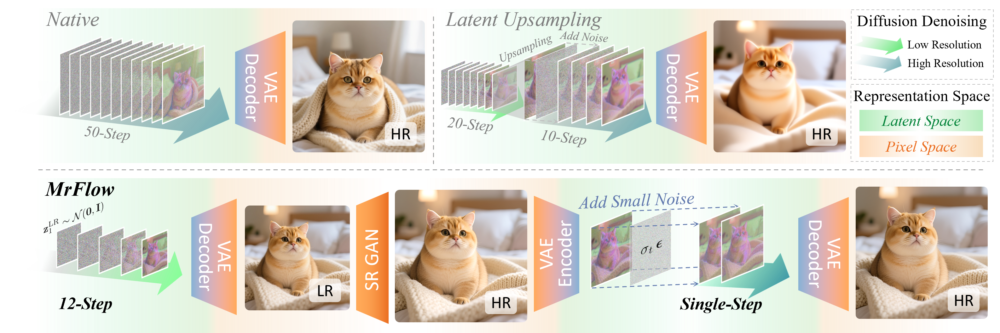
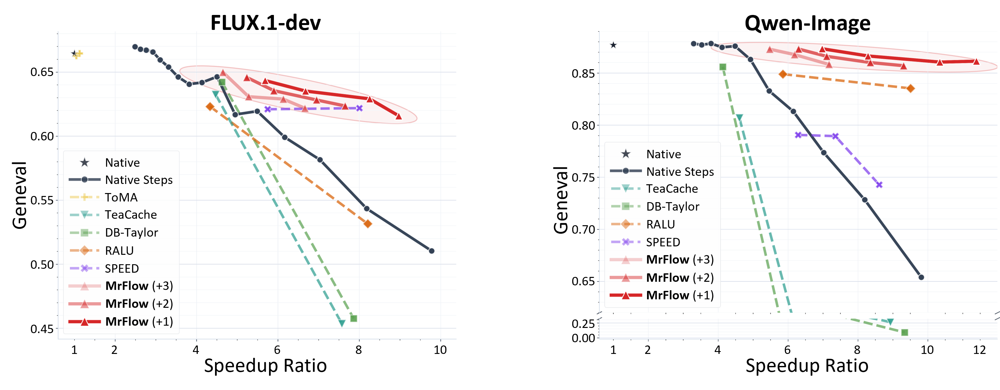
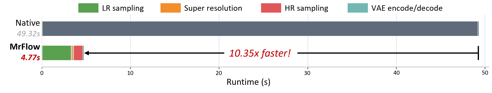

# Multi-Resolution Flow Matching: Training-Free Diffusion Acceleration via Staged Sampling

<div align="center">

### Official implementation for MrFlow

[](https://arxiv.org/abs/2607.01642)
[](https://huggingface.co/papers/2607.01642)
[](#highlights)
[](#results)
[](#supported-demos)

</div>

This repository provides the implementation of **MrFlow**, a training-free staged sampling method for accelerating pretrained flow-matching text-to-image diffusion models.

MrFlow first samples a low-resolution image, upsamples the decoded result in pixel space with Real-ESRGAN, re-encodes the upsampled image, injects scheduler-consistent low-strength noise, and performs a short high-resolution refinement. The pipeline shifts most denoising cost from expensive high-resolution sampling to cheaper low-resolution sampling while preserving local detail quality.

<p align="center">
  
</p>

## ✨ Highlights

- **Training-free deployment.** No finetuning, learned upsampler, or model-specific retraining is required.
- **No custom kernels.** The implementation uses standard PyTorch, Diffusers pipelines, and scheduler controls.
- **Strong aggressive-speed regime.** MrFlow reaches more than `10x` end-to-end speedup on Qwen-Image while preserving visual quality.
- **Works with distilled models.** The same pipeline can be combined with pretrained timestep-distilled models such as Pi-Flow and FLUX-schnell.
- **Compact staged design.** The implementation transfers across Qwen-Image, FLUX.1-dev, FLUX.2 Klein, and Z-Image families.

## 📢 News

- [2026/07] 📰 MrFlow is featured on [Hugging Face Daily Papers](https://huggingface.co/papers/2607.01642).
- [2026/07] ⚡ We release the MrFlow ComfyUI plugin.
- [2026/07] 🔥 The MrFlow paper is available on [arXiv](https://arxiv.org/abs/2607.01642), and the source code is released.

## 🛠️ Installation

Create a Diffusers-compatible environment for the target backbone. The demos use:

- PyTorch
- Diffusers
- Transformers
- Real-ESRGAN

MrFlow uses Real-ESRGAN for x2 pixel-space super-resolution. Install Real-ESRGAN from the official project and download the x2 weights:

```text
https://github.com/xinntao/Real-ESRGAN
```

The scripts contain placeholder checkpoint paths. Replace them with local paths to the pretrained text-to-image model and Real-ESRGAN x2 weights before running.

## 🚀 Quick Start

The repository root keeps only two minimal reference scripts plus the shared scheduler helper:

| Script | Model | Setting | Output |
| --- | --- | --- | --- |
| `qwen_image_mrflow.py` | Qwen-Image | MrFlow `12plus1` | `outputs/qwen_image_mrflow_12plus1/` |
| `flux1_mrflow.py` | FLUX.1-dev | MrFlow `12plus1` | `outputs/flux1_mrflow_12plus1/` |

Edit the checkpoint paths at the top of each script:

```python
MODEL = "/path/to/Qwen-Image"
REALESRGAN_X2 = "/path/to/RealESRGAN_x2.pth"
```

Run:

```bash
python qwen_image_mrflow.py
```

```bash
python flux1_mrflow.py
```

Each script saves:

- `stage1_low.png`: low-resolution generated image.
- `stage2_upscaled.png`: Real-ESRGAN x2 upsampled image.
- `stage3_refined.png`: final high-resolution refined image.

## ⚙️ Core Settings

| Setting | Low-resolution steps | Refinement steps | Direct sigma | Typical use |
| --- | ---: | ---: | ---: | --- |
| `12plus1` | 12 | 1 | `0.12` | Aggressive acceleration. |
| `20plus1` | 20 | 1 | `0.12` | Higher-quality operating point. |

The high-resolution refinement uses an explicit direct-sigma schedule. For example, `12plus1` denotes 12 low-resolution denoising steps followed by one high-resolution step from `sigma=0.12` to `0`.

## 📦 Supported Demos

Parameterized variants and additional model-family demos are available in `examples/`.

| Script | Backbone | Notes |
| --- | --- | --- |
| `examples/flux1_mrflow.py` | FLUX.1-dev | Training-free MrFlow. |
| `examples/flux1_piflow_mrflow.py` | FLUX.1-dev + Pi-Flow | Combines MrFlow with distilled weights. |
| `examples/qwen_image_mrflow.py` | Qwen-Image | Training-free MrFlow. |
| `examples/qwen_image_piflow_mrflow.py` | Qwen-Image + Pi-Flow | Combines MrFlow with distilled weights. |
| `examples/flux2_mrflow.py` | FLUX.2 Klein | Base and non-base variants. |
| `examples/zimage_turbo_mrflow.py` | Z-Image-Turbo | Reduced-step model plus MrFlow refinement. |

Run all configured examples with:

```bash
bash examples/run_examples.sh
```

See [examples/README.md](examples/README.md) for command-line usage, FLUX.2 Klein presets, Z-Image-Turbo refinement defaults, and output filename conventions.

Pi-Flow examples are optional and require a separate local checkout of [LakonLab](https://github.com/Lakonik/LakonLab). Set `LAKONLAB_ROOT` to that checkout before running the Pi-Flow scripts.

## 🧩 ComfyUI Plugin

<p align="center">
  
</p>

The repository also includes `ComfyUI-MrFlow/`, a ComfyUI custom-node extension for Qwen-oriented MrFlow workflows. It provides helper nodes, editable workflow and API JSON examples, a reusable subgraph, and a model-link helper for split Qwen-Image bundles.

To use it, place or symlink `ComfyUI-MrFlow/` into `ComfyUI/custom_nodes/`, restart ComfyUI, and open `ComfyUI-MrFlow/examples/qwen_mrflow_workflow.json` or load `ComfyUI-MrFlow/subgraphs/qwen_mrflow.json`.

## 🖼️ Results

**Qwen-Image generation examples.** With 12 low-resolution steps and one high-resolution refinement step, MrFlow produces diverse 1024-resolution samples on Qwen-Image while reaching above `10x` end-to-end speedup.

<p align="center">
  
</p>

**Accuracy-efficiency trade-off.** On FLUX.1-dev and Qwen-Image, MrFlow offers a flexible trade-off between generation quality and measured end-to-end speedup, and remains effective where other training-free strategies degrade sharply.

<p align="center">
  
</p>

**Runtime breakdown.** For Qwen-Image `12plus1`, measured end-to-end latency is `4.77s` versus `49.32s` for native 50-step inference. The main cost is shifted from high-resolution sampling to cheaper low-resolution sampling, while SR and VAE overhead remain small.

<p align="center">
  
</p>

## 📊 Representative Numbers

| Backbone | Setting | End-to-end speedup |
| --- | ---: | ---: |
| FLUX.1-dev | `12 + 1` | `8.25x` |
| Qwen-Image | `12 + 1` | `10.3x` |
| FLUX.2 Klein Base 9B | `12 + 1` | `8.79x` |
| Z-Image-Turbo | `8 + 1` | `21.0x` |
| Qwen-Image + Pi-Flow | `4 + 1` | up to `25x` |

Speedups are measured end to end, including text encoding, VAE encode/decode, super-resolution, noise preparation, and diffusion forward passes.

## 🗺️ Roadmap

- [x] Project README, framework figure, visual results, trade-off plot, and runtime breakdown.
- [x] Implementation code.
- [x] Public paper link.
- [x] ComfyUI extension plugin.
- [ ] Demo video.

## 📝 Citation

If you find MrFlow useful, please cite our paper:

```bibtex
@misc{zheng2026multiresolutionflowmatchingtrainingfree,
  title={Multi-Resolution Flow Matching: Training-Free Diffusion Acceleration via Staged Sampling},
  author={Xingyu Zheng and Xianglong Liu and Yifu Ding and Weilun Feng and Junqing Lin and Jinyang Guo and Haotong Qin},
  year={2026},
  eprint={2607.01642},
  archivePrefix={arXiv},
  primaryClass={cs.CV},
  url={https://arxiv.org/abs/2607.01642},
}
```

## 🙏 Acknowledgements

This implementation builds on the Diffusers ecosystem and uses [Real-ESRGAN](https://github.com/xinntao/Real-ESRGAN) for pixel-space super-resolution.
